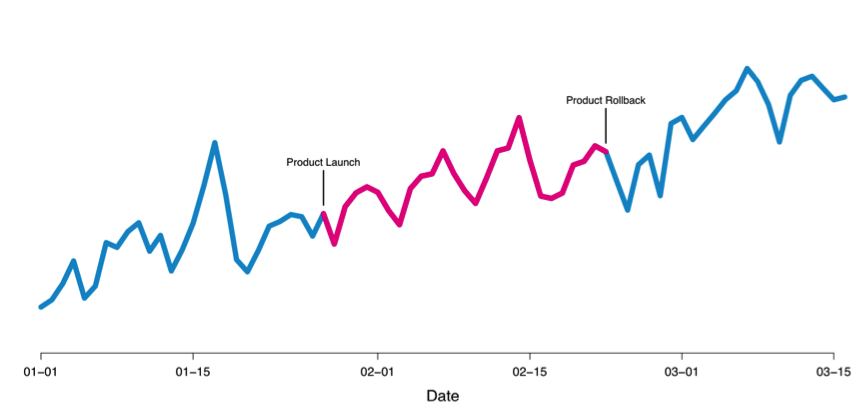

# 效果分析

A/B Test方向的大咖 Ron Kohavi 说过: ”拿到A/B Test的数据容易， 拿到可信的A/B Test的数据很难”。

## 因果推断

因果推断指的是如果我们在A和B中看到了指标的差异，那么我们可以把这个差异归因为A和B的不同，而不是其它因素。  

因果推断在观测数据上面通常就没有办法得到保障，如  
airbnb在一月底进行了一次product launch(产品发布)，虽然产品发布以后指标有上升的趋势，
但是airbnb在2月20号左右进行了product rollback(产品回滚)，产品回滚以后指标仍然处于上升的趋势。
所以我们没有办法确定指标的上升到底是由product launch(产品发布)带来的还是由于其它的因素。  

流量的随机分配使因果推断成为可能。
