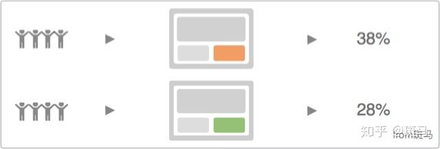

# What Is A/B Test?

也称为分离测试，国内习惯称为A/B Test。

A/B Test的概念来源于生物医学的双盲测试，双盲测试中病人被随机分成两组，在不知情的情况下分别给予安慰剂和测试用药，  
经过一段时间的实验后再来比较这两组病人的表现是否具有显著的差异，从而决定测试用药是否有效。

## Why A/B Test ?

A/B test可以回答两个问题：
（1）   哪个方案好
（2）   结果的可信程度

A/B Test 是基于用户得到的结果，用数据说话， 而不是凭空想象去为用户代言，并且通过一定的数学分析给出结果的可信度。

* A/B 测试是一种产品优化方   
为同一个优化目标制定两个方案，让同一部分用户中的一部分用户命中 A 方案，同时另一部分用户命中 B 方案，  
统计并比较不同方案的点击率、转化率等数据指标，通过不同方案的数据表现，在确定数据表现通过假设检验后，决定最终方案的实验方法。



上面所示就是一个典型的A/B Test示例；
在A/B Test中可能并不局限于只有A、B两个版本，可能会有ABC测试、ABCD测试，甚至是ABCDE测试。
有一些情况，可能会出现比较特殊的A/B Test，
比如说AAB，因为需要验证整个A/B 实验平台的准确度，需要设置两个对照组，所以叫AAB测试。
不管同时运行几个实验，我们都可以将它们统称为A/B Test。

* AB测试是支持数据决策最有力的工具

## 实施前提

A/B测试的应用范围：  
A/B测试必须是单变量，但有的时候，我们并不追求知道某个细节对方案的影响，  
而只想知道方案的整体效果如何，那么可以适当增加变量，  
当然测试方案有非常大的差异时一般不太适合做A/B测试，  
因为它们的 变量太多了，变量之间会有很多的干扰，所以很难通过A/B测试的方法找出各个变量对结果的影响程度。

## 应用

A/B Test在互联网产品中的应用方法是：
为优化某个指标制定两个（或以上）方案，在同一时间维度将用户流量对应分成几组，
在保证每组用户特征相同的前提下，让用户分别看到不同的方案设计，根据几组用户的真实数据反馈，科学的帮助产品进行决策。

从对A/B Test的定义中可以看出A/B Test强调的是同一时间维度对相似属性分组用户的测试，  
时间的统一性有效的规避了因为时间、季节等因素带来的影响，而属性的相似性则使得地域、性别、年龄等等其他因素对效果统计的影响降至最低。

### 场景

有新的产品优化或者功能迭代，尤其是对用户使用路径或者便捷性影响较大的改动
精细化运营中，针对不同人群各种类型的活动尝试
推荐策略的优化或新增
算法版本迭代
版本灰度发布

## 流程

以下为最基础的数据驱动流程，方案验证即为AB测试过程，实验才是检验真理的唯一标准。
```text
数据收集
数据分析
发现问题
提出方案
方案验证
发布上线
```
```text
建立产品漏斗 
确定产品链路核心指标
观察指标，提出优化假设
设计 A/B 实验方案
开发 A/B 实验
运行实验
实验数据分析
实验结论
```

## 特性

1. 同时性
两个策略是同时投入使用的，而不是AB两种策略分先后上线，这样会有其他因素影响。

2. 同质性
两个策略对应的使用群体需要保证尽量一致。

## 分类

* MVT 最小可行性实验
就是如何最快的用最简单的方式实现你的想法，可能设计不是很好看，程序也不是很稳定，但是先看看结果怎么样。
如果结果是好的，可以再去做好做精。

* Double Down 乘胜追击
当你看到一个试验有好结果的时候，你要在这个地方下更多的赌注，做更多的试验，直到这个地方的边际效应变得很低。

* Optimization 优化试验
针对一个小的点做很多的优化。

* Exploration 探索性试验
尝试新的方向，可能是比较大的变动

```text
文案测试
功能MVP
设计测试
路径测试
```
