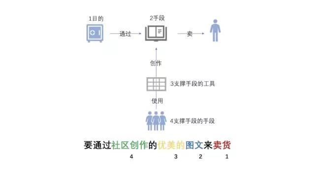
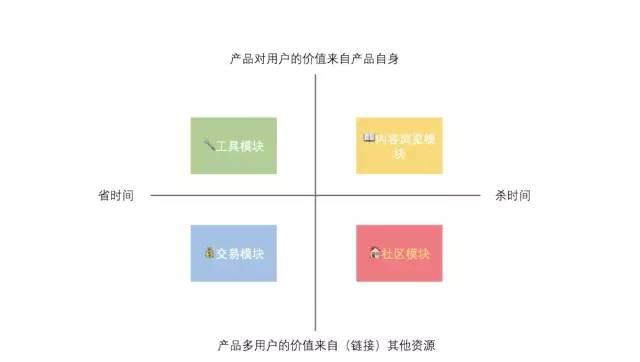
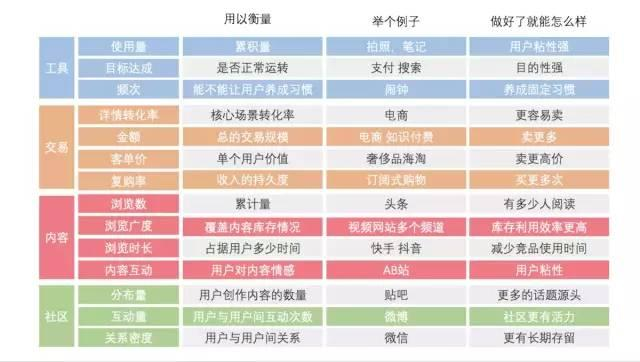

# 如何选取数据指标？

# 第一步从业务的最终目的出发梳理业务模块



# 第二步判断业务模块所属类型

把于业务模块分为四类，工具模块，内容浏览模块，交易模块，社区模块。



# 第三步根据业务模块所属类型选择数据指标

如何给对应的模块选择对应的指标，选择对应的指标，首先要明白不同类型的模块里面要关注的指标是什么？

## 工具模块主要是关于效率

```text
使用量（描述了什么：累积量，投入程度 举例子：拍照，笔记 做好了就可以怎么样：用户粘性强）
目标达成率（描述了什么：是否正常运转，举例子：支付搜索 做好了就可以怎么样：满意度高）
频次（描述了什么：能不能让用户养成习惯 举例子：闹钟 做好了就可以怎么样：养成习惯）
```
如：QQ 音乐的歌词海报功能 也就是创建歌词海报 
```text
使用量：累积量，投入程度 进入歌词创建环节量 
目标达成率：是否正常运转，海报生成 
频次：能不能让用户养成习惯 功能使用频率
```

## 内容浏览模块在乎的是质和量
```text
浏览数（描述：累计量 案例：头条 做好了就能怎么样：多少人阅读）
浏览广度（描述：覆盖内容库存情况 案例：视频网站多个频道 好处：库存利用效率更高）
浏览时长（描述：占据用户多少时间 案例：快手抖音 好处：减少竞品使用时间）
互动内容（描述：用户对内容的情感 案例：a B站 好处：用户粘性。）
```

## 交易模块最关注的是转化率
```text
详情页转化率（描述了什么：核心场景转化率，举个例子：电商，做好了就能怎样：更容易卖）
金额（描述了什么：总的交易模块，举个例子：电商知识付费，做好了就能怎样：卖更多。）
客单价（描述了什么：单个用户价值，举个例子：奢侈品海淘 做好了就能怎么样：卖更高价)
复购率（描述了什么：收入的持久度 举个列子：订阅式购物 做好了就能怎么样：卖更多次）
```

## 社区模块最关注的是活跃
```text
发布量（描述：用户创作的内容数量 案例：贴吧 做好了就能怎么样：更多的话题源头）
互动量（用户于用户之间互动次数 案例：微博 做好了就能怎么样：社区更具有活力
关机密度（用户之间的关系，案例：微信 做了就能怎么样：更有可能长期留存
```

## 案例-脉脉


# 案例实战 - 闲鱼

## 第一步：要分析一下闲置这个产品
想通过给卖家提供易用的快速发布工具，给买家提供各种的商品信息浏览返回式，并且通过鱼塘将双方聚焦起来分发信息。
闲鱼是个CtoC的交易流量，它分为买家和卖家。
买家：有各种商品信息浏览的方式 内容浏览：分类。 社区：鱼塘（按位置或兴趣，方便交流）
卖家：方便的商品发布工具和商品分发的方式。工具：易用的快速发布的工具。社区鱼塘用来分发。

## 第二步：确定模块
我们通过分析产品从买家和卖家了解了有哪些模块，内容/社区/工具。

## 第三步：选择指标
内容模块：分类（商品的浏览量）。
社区：鱼塘（商品内容日发布量/率。商品内容被查看量/率。商品内容被询问量/率）
工具：发布工具（商品发布成功率）

# 参考

* [产品选好数据指标的通用方法论](https://www.toutiao.com/i6766532279830315533/)
