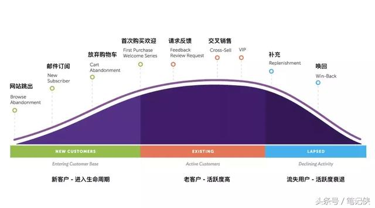

# Karmaloop  

- 10个月时间，增长黑客如何挽救这家破产的电商巨头？

Karmaloop 是美国潮牌电商巨头。  

## 背景

Karmaloop不断壮大，在2007年进入了鼎盛时期
2013年，Karmaloop终于登上顶峰 ——营业额突破1.27亿美金，远远甩开其它潮牌电商，稳居行业第一，成为了美国最大的潮牌经销平台。
2014年，Karmaloop更是在“互联网零售500强”中排名134位。但是，看似一片繁荣的背后，却是1亿美元的银行债务。
2015年，局面彻底失控，Karmaloop的营业额缩水到原来的一半。一切挽救行动均宣告失败，Karmaloop正式宣告破产。
最终，投资过Karmaloop的私募机构Comvest花费1300万美元，买下了这个烂摊子 ————昔日的巨头被迫以一个月的营业额把自己卖了！

在Comvest的盛情邀请下，杜鲁决定接受这个挑战，临危受命，出任Karmaloop的CMO。
【杜鲁·萨诺科齐（Drew Sanocki）】

## 问题

只关注用户获取，而不重视留存和变现——大批的用户点水而过，没有给公司创造任何价值。
2008年拿了一大笔投资之后，VC急切渴望看到成绩。因此，格雷格决定抄捷径：花钱买流量。没人意识到虚荣的流量其实未曾带来收入。

不过，由于用力过猛，钱都烧光了，公司开始负债。银行还在天天催着还钱，Karmaloop才被迫想办法提升留存，促进变现。

但是，心急的格雷格（CEO）干脆一刀切：使用打折促销作为激活用户的手段，直接推动留存和变现。
这其实是完全错误的，因为用打折的方式吸引的用户必然是消费能力不高、生命周期价值很低。
这让本来就不理想的留存率进一步恶化，获得的营收根本抵不上广告投入，还把供应商得罪了。

最后, 为了节约开支，提高变现环节的利润，Karmaloop才决定采用Dropship直发模式
不过，这也是反其道而行之——大批高价值的老客户流失，原本固定的收入来源也惨遭冲击。

这让 Karmloop 陷入了恶性循环：不断烧钱，低质量的新客户在增加，高质量的老客户在减少，越来越亏。  

## 增长黑客

杜鲁意识到：  
要想扭转局势，就必须获取更多高价值的客户，并且留住他们，最终让他们带来足够的收入。  

### 用户获取

面对一团乱麻，杜鲁遭遇的一个问题就是：  
高价值的客户从哪里来？  

#### 1. 转化低价值用户

最实际的方案就是把之前的低价值用户转化为高价值用户（或者说筛选出潜在的高价值用户）。  

* “拌网策略”  

```
①对高价值客户行为进行数据建模
②找到实际数据与理想数据的偏差（即“拌网”）
③集中营销工作的时间和精力，纠正这些偏差。
```

* * 例子  

```
他每个周五都要去一家名叫Slow Burn的健身房锻炼身体，对于健身房来说，他就是理想客户，“每周五都来健身”就是所谓的标准模型。

但是，过了几个月，他不想去了，可能的原因有三个：
自己找到了另一家更好的健身房
觉得价格太高了（可能性比较低）
自己变懒了（可能性比较高）

“停止去健身”就是所谓的偏差（拌网）。

Slow Burn注意到了这个情况，开始一系列营销活动：提醒他克制懒惰，并送了优惠券给他！
他收到了优惠券，并为自己的懒惰感到惭愧，于是又重新回到了健身房——偏差就这样被纠正了。
```

理论的核心就是：
公司不应该在所有用户上投入相同的营销成本，而是找到那些阻碍普通用户成为高价值用户的“拌网”，然后投入最大精力去解决这个障碍。

从入职第一天起，他就花费了整整一个月去研究Karmaloop近10年的交易数据，并利用RFM模型进行了分析。

* 创建了两个简单的用户分层：  

```
鲸鱼：
    多次复购，消费额高，很少退货。
    代表高价值、高LTV的用户层。
```
```
鲦鱼：
    仅购买一次，只买便宜的商品，而且退货率高。
    代表低质量、低LTV的用户层，如果算上各种成本，这个分层其实在给公司亏钱。
```

杜鲁惊讶的发现，“鲸鱼”们只占了1.3%的访问量，却贡献了43%的收入！
这些历史数据让Karmaloop的问题暴露无遗：鲦鱼太多而鲸鱼太少，所以才一直亏钱。

* 用两个简单的步骤分析近期订单数据：  

```
① 选中所有满足“鲸鱼”特征的用户；
② 计算第一次和第二次购买之间平均间隔天数。
```

发现，80%的情况下，如果一个用户要下单两次，他们都会在第一个订单之后的30天内完成第二单。

***没错，这就是杜鲁找到的“拌网“ —— 大多数“鲦鱼”并不会在30天的周期内产生复购行为。***  

前面的数据分析表明，如果一个用户在第一天下了单，但后续的30天内没有下第二单，那他就越来越不可能成为“鲸鱼”了。  
但是，如果他们在30内下了单（符合理想用户行为），那就有很大机会成为“鲸鱼”。

Karmaloop需要做的就是使用合理的营销方式与这些”鲦鱼“用户层进行沟通，  
引导他们在30天下第二个订单，逐步让他们转变为“鲸鱼”。

* 制定了两种营销策略：  

```
在30天内 ——> 用户有机会完成二次复购 ——>给用户推销原价（高利润）的产品
在30天之后——>用户越来越难完成二次复购——>用大额优惠（低利润）刺激用户
```

作为CMO，杜鲁的第一项行动就是:不再给30天周期内的用户发送优惠券。
另一方面，超过30天后，用户复购的几率依旧随着时间的延长而衰减。  
因此，杜鲁给优惠券设定了一个梯度：间隔时间越长，优惠额度越大。  

* 完整的流程就是：  

```
① 用户首次购买后若处于30天周期内，则给他推送原价商品；
② 在30天之后还未复购，则给用户推送10%折扣券；
③ 如果超过了45天，给用户推送20%折扣券；
④ 如果超过了60天，一律推送30%折扣券；
⑤ 如果用户在任意阶段产生了复购行为，则不会触发后续的优惠；
⑥ 时间周期和优惠额度会根据数据反馈进行调整。
```

* 计划制定好了，如何把营销信息推送给客户呢？

在海外市场，Email的地位相当于国内的公众号，而Karmaloop凭借十几年的积累已经有了数百万Email订阅用户，
杜鲁决定利用这些先天的优势，将Email作为营销的主战场。

在团队的帮助下，他建立起了基于CRM和Klaviyo软件的自动化邮件系统。

当邮件取得良好的效果后，营销团队会迅速把活动更新到网站主页、Facebook定向广告、甚至是邮寄的贺卡中。

#### 2. 社交媒体

现在，一部分有潜力的“鲦鱼”已经能够被转化为“鲸鱼”了。  
但是，比起之前的损失来说，目前的营收增长还远远不够。
社交媒体是时尚行业的必争之地，所以，接下来杜鲁开始寻找新的社交媒体渠道，进一步获取高价值客户。

* 首先是Instagram  

根据杜鲁从Shopify内部得到的消息，在所有营收超过百万美金的Shopify店铺中，90%都在依赖Instagram做营销。

因此，杜鲁也想在Karmaloop身上尝试一下。  
他从团队中挑选了一位十分有干劲的小伙子，专门负责Instagram等平台的运营，不断寻求KOL合作机会。

* 其次是Youtube  

在公司倒闭之前，格雷格的KarmaloopTV项目拍摄了大量原创视频，都是放在youtube频道中。  
但是，现在既然没钱了，这个频道肯定也就开不下去了。

于是，杜鲁放弃原创视频的想法，转而借助KOL的力量。

在Youtube上，有许多被称为“hauler”的网红：  
他们经常拍摄潮牌的开箱评测，讲解服饰穿搭。自然，这些网红的粉丝一定是Karmaloop的精准客户了。

杜鲁立刻安排团队拿下了大批hauler，把Karmaloop售卖的招牌产品交给他们去评测，并且跟他们联合举办抽奖活动。  
关注Instagram，留言送潮牌！

### 激活留存

高价值用户的增长仅仅是开端。接下来，还有更重要的一步：激活并留住他们。
杜鲁应用了生命周期营销策略，即在正确的时间，把正确的信息传递给正确的人。

#### 构建起了一个客户的生命周期流程



可以看到，任何客户都会经历新手期，活跃期到流失期三个阶段。
借助自动化的邮件系统，杜鲁让营销邮件贯穿每个客户的生命周期。  
从获取客户开始，5——6个邮件campaign就开始运行了。无论用户进行到哪个时间节点，都能通过邮件接收到最恰当的营销信息。

##### 1.新手期
这个阶段的营销目标是引导用户产生第一次购买。

当用户注册/订阅邮件后，立刻启动“欢迎系列邮件”，即利用5——7封邮件逐步建立品牌信任度、传递Karmaloop的价值、宣传部分招牌产品。

通过欢迎阶段后，许多用户已经准备好要剁手了。  
但是，从建立信任到最终付款之间，还有一个“隐形杀手”：放弃购物车（cart abandonment）。

2016年的数据显示，全球电商的平均弃车率高达77%！因此，杜鲁特意设定了一系列邮件，唤回那些弃车的用户。

##### 2.活跃期
这个阶段的营销目标是让用户保持活跃，持续消费。

* 怎样才能让客户不断来关注Karmaloop呢？

杜鲁的团队创建了一个VIP计划：
如果某个用户的消费行为接近“鲸鱼”（举例来说，如果他下了单，而且其平均订单价值（AOV）或者平均订单数量超过某个固定值），  
就把他定义为VIP用户 —— 随后会触发相应的营销活动（比如特殊折扣），而且用户会收到一封感谢邮件。  

##### 3.流失期
这个阶段营销目的是唤回流失的老用户。

事实上，大部分Karmaloop的老用户依然停留在这个阶段。  
公司在倒闭时的垂死挣扎，很大程度上影响了他们的体验，导致信任度大减。

既然这些老用户都在邮件订阅列表上，继续用邮件唤回他们不是很简单吗？  
不过，杜鲁马上意识到自己低估这件事的难度,最初的唤回成功率相当低。  
当你失去一个人的信任之后，就很难争取第二次机会了。  

* A/B测试  

碰壁之后，杜鲁马上启用了增长黑客的秘诀——A/B测试。  
他将流失的老用户群划分成许多个10000人的小组，逐步测试不同的方案。  

他们首先尝试了10——30%范围内的折扣，随后又试了下次购买返现金，紧接着是送礼品卡，最后还试了“CEO亲笔信”，甚至是打电话……

进过不懈的努力，在经历过20多次失败的测试后，杜鲁终于找到了一套最佳组合，老客户们渐渐认可了新生的Karmaloop。

* 问卷

为了能够在整个生命周期内更好的理解高价值用户的行为，杜鲁的团队还利用SurveyMonkey进行了NPS问卷，即询问用户：
“你有多大意愿把Karmaloop推荐给朋友（1分到10分）？”

另外，问卷还包括几个核心问题：
你还在其它什么地方购物？
哪些商品我们应该卖却没有卖？
你平时都阅读哪些博客？

正是通过不断的学习和理解，杜鲁对客户的需求有了更加精准的把握，大大改进了Karmaloop的用户体验和客户服务。

在之前的运营中，Karmaloop根本没有进行任何客户生命周期的营销，这无疑是巨大的突破。

### 提高营收

在杜鲁的推动下，Karmaloop终于能够把高价值客户留存下来了。  
不过，要形成完整的增长闭环，还差最后的盈利阶段：把留下来的客户转化为收入。

由于之前的Dropship模式宣告失败，所以Karmaloop还要回归到传统的备货模式。  
因此，想通过压缩成本来提高利润的方法是行不通了。所以，杜鲁设法提高每用户平均收入（ARPU）。

#### 1.提高商品单价  

事实上，Karmaloop之前的打折策略是严重违背其商业价值的：
潮牌本身并没有太多物质上的价值，更多的是精神/文化层面的追求和认可——用时髦点的话来说，就是“共识”。

比如Supreme从来不打折，但官网的新品总是在几十秒内售罄。
他相信，经过一番调整，Karmaloop现有的用户并不是冲着廉价而来的，而是认可潮牌的价值。

* 那么，顾客到底愿意花多少钱买Karmaloop的产品呢？  

杜鲁继续发扬增长黑客的精神，开始了价格实验，针对不同商品供需关系，分组后逐步提价，然后观察用户的购买行为。  

他首先把注意力放到了Karmaloop最热销的打底T恤上。  
经过一段时间提价，他惊讶的发现：价格提高30%后并不会影响销量！也就是说，这个品类的收入足足增加了30%！  

#### 2.交叉销售

数据显示，亚马逊35%的收入都来自于交叉销售（cross——sell）。  
在Karmaloop，杜鲁开始实践交叉销售。简单来说，就是向购买过本公司A产品的客户推销本公司B产品。  

从心理学的角度上来说，刚刚完成一次购买的用户正处于“购物期”，心理防线非常薄弱，难以抵抗二次诱惑。    
借助邮件营销，Karmaloop得以大大提升客户的生命周期价值。   

### 绝地逆转

不到3个月时间，杜鲁就取得了卓越的成效，把公司营收提高了30%，客户生命周期营销活动的ROI高达500%！  
最终，仅用了10个月时间，杜鲁就将Karmaloop扭亏为盈。  

一年半后，Karmaloop以数千万美金的价格出售给了美国球鞋零售商Shiekh Shoes，  
本该从历史上抹去的巨头再次焕发了活力，实现了真正的绝地逆转。  

当然，功劳不仅是杜鲁一人的。    
这个过程中，Karmaloop的CEO也起到了重要作用，包括与品牌方谈判，整顿公司管理，调整供应链等等。   

另外，杜鲁手下还有一票得力干将，包括一名邮件营销的工程师，一个设计创意团队——以及整个产品部门的支援。  

### 总结

这个案例为我们清晰地展示了一位CMO如何利用数据来做决策，科学推动公司的增长和提高——其实这些都是首席增长官CGO的职责。

看来，可口可乐用CGO取代CMO，并非炒作，而是切实的需求所迫。  
CMO如何避免被取代呢？当然是秉承精细化运营的思路，坚持数据+技术驱动增长！  

* 总结一下，杜鲁究竟做了哪些事让Karmaloop起死回生：  


