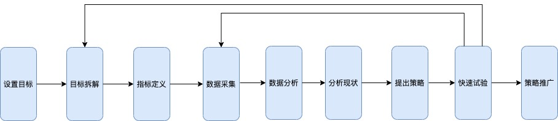
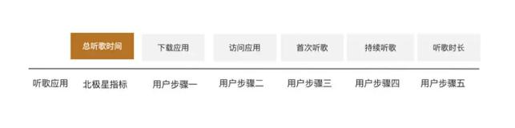
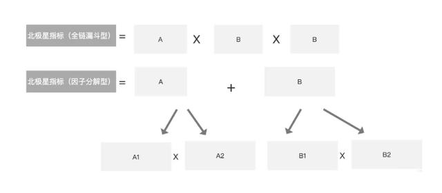
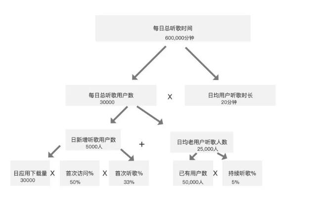

# 增长框架

增长模型是帮助大家把不可以操作的一个结果一个北极星指标，分解成可以操作的一些细分指标，然后大家可以通过细分指标改善最终的结果.
如：北极星指标是日活跃用户，很难直接做一些什么来提升日活，能做的是影响这些的细分指标，APP下载量、用户激活率、老用户留存。

## 步骤 ： 




## 增长模型案例 - 网易云音乐

### 第一步：北极星指标为总听歌时间。

### 第二步：绘制用户核心转化路径。


### 第三步：组装增长模型



* 全链漏斗模型

总听歌时间 = 应用下载量 * 首次访问% * 首次听歌% * 持续听歌% * 平均听歌时长

全链漏斗模型：优点把影响北极星指标的主要细分指标都显示出来，并标注转化率，找到机会点，容易搭建。
缺点：不能直接计算北极星指标。

* 因子分解模型


因子分解模型：优点把影响北极星指标的主要细分指标都显示出来，并标注转化率，找到机会点，容易搭建。
缺点：不能直接计算北极星指标。

## 如何应用增长模型？

```text
问题一：想要增长北极星指标，AARRR里可做的事情很多，如何决定先做什么后做什么？
问题二：小公司资源有限，如何找到性价比最高的点将增长效果最大化？
```
找到聚焦领域-四两拨千斤的增长发力点。

```text
问题一：业务很复杂，感觉千头万绪，不知道从何下手推动增长。
问题二：想要改善北极星指标，但是落实到产品、运营等还是没有具体的想法如何做？
```
寻找具体的增长思路

```text
问题一：作为增长负责人，定了北极星目标，如何把活分下去，并保证执行团队和我的思路一致减少失误？
问题二：作为执行团队，如何清晰的知道自己的任务，可以在快节奏的日常工作中作出正确的决定？
问题三：如果公司里有多个团队合作推动增长，如何保证大家劲往一处使？
```
指导指标拆分和团队协作
```text
协作模式一：每个跨功能团队单独承担一个细分指标
协作模式二：多个团队合作推动同一细分指标
```

## 参考

* [构建和应用三种增长模型](https://www.toutiao.com/i6756150198474375684/)

