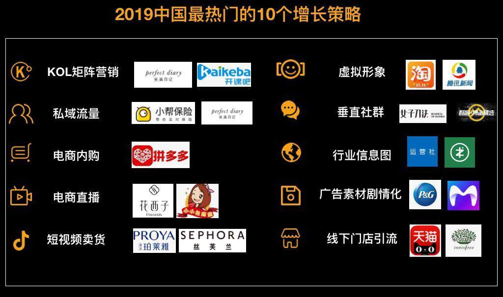
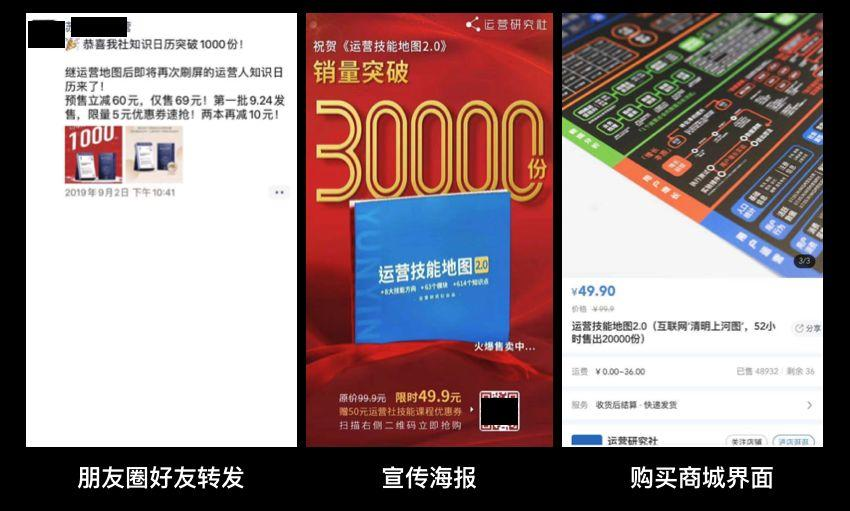
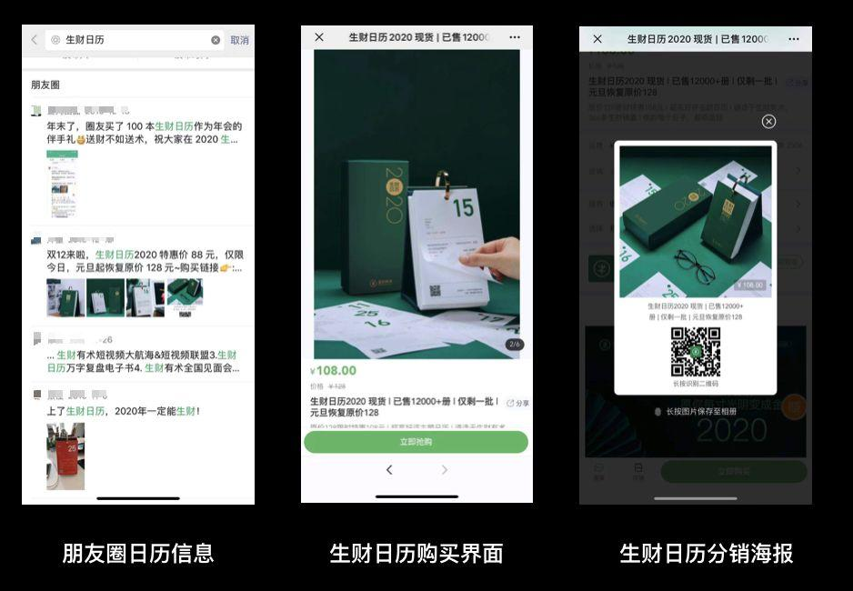
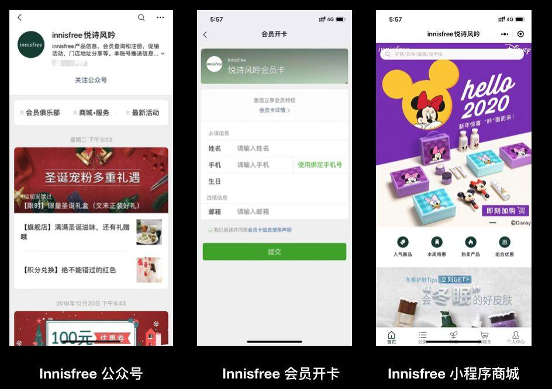

  

* 2019 热门增长策略玩法  
      * [KOL矩阵营销](#kol矩阵营销)  
      * [私域流量](#私域流量)  
      * [电商内购](#电商内购)  
      * [电商直播](#电商直播)  
      * [短视频卖货](#短视频卖货)  
      * [虚拟形象](#虚拟形象)  
      * [垂直社群](#垂直社群)  
      * [行业信息图](#行业信息图)  
      * [广告素材剧情化](#广告素材剧情化)  
      * [线下门店引流](#线下门店引流)  

## KOL矩阵营销
今年KOL矩阵营销呈现媒介分散化趋势，头部的KOL的话语权也逐渐下沉，衍生出新的概念KOC。
从不同的粉丝数体量来看，头部的KOL引流价值大，腰部KOL性价比高，而长尾KOL在内容分发和扩散上具有不可忽视的价值。
品牌方通过KOL营销投放，打通头部、腰部、尾部的KOL，进行矩阵式投放，品牌方才得以打透圈层，制作更大的影响力。

* 案例1：完美日记
今年美妆行业最亮眼的产品，无疑是号称“国货之光”的完美日记。
2016年诞生的品牌，2017年才有天猫旗舰店，到了2019年天猫618，完美日记仅用了一小时就荣登天猫彩妆Top1。

仅用8个月时间，销量增长了近50倍，不但力压美康粉黛等国货同行，而且全面赶超YSL、SK-II等国际大牌。  
在2018年，完美日记仅在天猫的GMV就高达6.5亿元。

完美日记2019年1月到7月的时间里投放里683位达人，比去年同期多里438位。  
完美日记凭借对小红书众多 KOL 投放，规律性的打造爆款，进而配合微信私域流量的运营。

* 案例2：开课吧
开课吧是为互联网从业者提供技能提升的线上培训平台，通过整合IT和互联网企业师资及实战项目。
现在平台上基本覆盖了互联网从业者所需要的在线课程，比如Web前端、Java、Python、大数据等。

2019年开课吧主要的投放渠道是在公众号上，根据西瓜数据我们挖掘到在2019年11月份到12月份，两个月的时间就投放了301个公众号。  
并且据我了解，开课吧每个月单个号复投率都很高，互联网圈的号基本血洗好几遍。

尤其技术圈的号，开课吧已经投放过的中腰公众号不下1000多位。  
整个圈层基本被打透，圈层内的人现在都知道开课吧这个平台。  

## 私域流量
私域流量是2019年非常火爆的词语，但这种流量的运营方式其实很早就有了，  
只是因为现在流量越来越难获取，大家开始注重流量的精细化运营，把老用户的价值发挥最大化，所以私域流量才会在2019年火起来。

私域流量相对其他流量来说，我们无需付费，可以在任意时间、任意频次、直接触达用户的渠道。  
而微信生态就是私域流量最好的载体，例如：微信群、个人号、朋友圈。

值得一提的是最近企业微信更新到了 3.0 版本，打通了个人微信号，认证过的企业微信号，  
好友人数无上限，自动回复、群发助手以及朋友圈开放等功能的更新。  
这些功能的开放，让企业微信变成私域流量更好的载体。未来企业微信的流量，都是兵家必争之地。

* 案例1：小帮保险
互联网保险是今年唯数不多，还保持高速增长的赛道。各种第三方保险平台增长迅猛，大量资本涌入。  
从商业逻辑上来讲，这些平台确实是需要刚需。因为目前保险市场信息很混乱，普通人不知道要买什么样的保险。

第三方保险平台就应运而生，以“评测”、“教程”的形式为用户提供顾问服务，并推荐保险产品。  
其中小帮保险已经完成了2亿元B轮融资，规模逐渐越来越大。

在我们观察到的投放数据中发现，小帮保险一直在公众号领域进行投放。  
仅在2019年7月到9月，三个月的时间内就投放了236个公众号，产生了164万阅读量。

投放的素材都是统一引流到导师的个人微信号，然后加群精细化运营。  
引导用户购买9.9元的1对1保险顾问服务，最后在让用户购买相应的保险产品。

* 案例2：完美日记小完子体系
在KOL矩阵营销中我们提及到，完美日记在小红书上投放大量KOL。  
而这些公域来的流量，完美日记都沉淀到自己的私域流量体系内，提高用户的终身价值。

在流程上用户购买完美日记的产品后，随包裹附送一张“红包卡”，刮开图层可获得特殊口令。  
扫码关注公众号，公众号会立刻推送一个页面，包含个人号二维码。  
添加个人号后收到一个小程序二维码，扫码并输入口令，即可领1-2元红包。

保守估计，完美日记有上百个个人号，其统一标识为“小完子”这个人设。  
按照3000人/号的标准来计算，处于”私域“的粉丝量应该在近百万级别。

## 电商内购
电商平台每年对于流量的采购都非常大，追求极致的曝光率。  
但平台的获客成本，不论是阿里、京东还是唯品会，都一直在上升。困境之下，总会有新的突破。  

最近几年通过用户的人际传播，以及激活下沉市场小型商家的供应链，  
拼多多利用拼购业务节省了大量的获客成本和渠道成本，硬是在阿里和京东两大电商巨头小杀出第三条路。

“信任成本”也是阻碍用户下单重要的因素，  
在此基础上拼多多又研发了新的玩法：电商内购，通过内购福利，极大提升可信度，还融入裂变属性，让拼多多持续增长。

* 案例：拼多多内购福利
拼多多对于流量的增长一直别出心载，从人们熟知的帮我砍一刀，到最近的电商内购福利，对于人性的把控都非常到位。

最开始拼多多把内部福利做成 xlsx 的文件，在聊天界面上看就像是一个 excel 的文件。  
但实际点进去确是一个仿造的网页界面，里面全是拼多多上优惠的商品，点击生成内购按钮，则是叫你下载拼多多app。

一方面这样的形式可以减低用户的决策成本，都是大家日常生活中熟悉的内容，另一方面可以消除用户的戒备之心。

后来这个套路被大家熟知之后，拼多多的内购玩法又开始升级了，变成企业员工内购小程序。  
“内购”、“亲友”关键词，非常能抓住用户的心理。

而且小程序里面的商品价格也非常低，比如 Airpods2 耳机内购价只要 850 元，比市场价低了 238 元。  
但需要 27 张内购券，而内购券的获取需要邀请好友，每邀请一位随机得 1-5 张。  

## 电商直播
直播电商是现阶段购买转化率最高的方式之一，淘宝直播2018年就已经有上千亿GMV，下单人群总数超过一亿。  
甚至淘宝直播的入口被提升到一级页面，还独立出一个APP。

做为国内另一大短视频巨头快手，直播也是快手主要收入来源。  
2018年下半年快手小店的开设，更加速直播电商的变现。  
快手商家号用户数超过60万，每日新增用户数超过1万，日均直播场次超过20万。

其他巨头平台，例如字节跳动、微博、腾讯也纷纷开始布局直播电商。高达数千亿的直播电商市场正值风口。  
品牌方借助电商主播惊人的流量，以及超强的带货属性，在今年创造一个又一个带货佳话。

* 案例1：花西子

李佳琦做为直播电商顶级流量的人物，江湖代号“口红一哥”，全网粉丝量达到了3000万。  
头部的电商主播，带来的流量效应是非常惊人，花西子很好的把握这一点。  

在我们之前用增长工程学调查李佳琦在淘宝上直播的数据发现，李佳琦直播中商品出现最多的品牌词之一就是花西子，  
并且在今年双十一从预售到11月11号贯穿李佳琦的直全过程。

花西子今年才加入双十一大战且首次参加天猫双11。  
在仅仅开场1小时后成交额便顺利破亿，热销单品散粉在当天爆卖70多万盒，成为为数不多迈入“亿元俱乐部”的国货品牌之一。

* 案例2：小小包麻麻
直播电商火爆的同时，做为社交巨头的腾讯也不甘示弱，腾讯也在今年做起「腾讯直播」。  
与抖音、快手、淘宝直播不同的是，腾讯的直播更加注重内容，腾讯直播布局的是内容直播，用故事赢人心。

小小包麻麻做为第一位被邀请开通腾讯直播的母婴品牌，用聊天式的直播带货，就卖出216万元。  
包妈和粉丝一个多小时的直播，直播期间观看人次超过13.1万，小小包麻麻电商小程序页面浏览量超65.8万。  
直播期间产品销售15360件，总销售额突破216万。

这次的直播与大家常见的直播方式不同，没有追求感官刺激，也没有过分的语言包装。  
包妈用耐心讲解的方式，去诉说产品和品牌背后的故事。从产品入手，回归品牌，用讲故事的方式品效合一。

## 短视频卖货
在2018年的十大增长黑客策略中，我们就提到短视频引流的策略。  
但当时正处于短视频用户红利期，那时候大家都还只聚焦如何获客。

今年短视频依旧火爆，用户的注意力持续向短视频转移，消费品利用创意视频带货的效果更加显著。  
过去大家都是用短视频进行产品引流，今年大家更关注销售转化，规模化的投放与脚本创作将成为重点。

通过抖音独特的推荐算法，把想要带的货精准推送到合适的人群。一个视频带出百万销售，在2019年不断上演。

* 案例1：珀莱雅泡泡面膜
在刀姐的文章《「泡泡面膜」月销6000万的爆品投放方法论》中就总结到，珀莱雅爆款的泡泡面膜符合四个属性：
抵抗无趣生活的新奇感；
疗效感；
社交货币；
低于 100 元的价格。

珀莱雅做为老牌国货成功借助抖音突出重围，不仅仅是依靠短视频卖货的红利期，更是自身不断打磨产品从而符合现在人群的需求。

* 案例2：丝芙兰55号粉底刷
探店式实测；
手臂上妆实测；
美妆蛋和化妆刷对比实测。

## 虚拟形象
2019年8月30日微信朋友圈被几条换脸视频刷屏，只要上传你的照片，就可以变成经典视频中的明星脸。  
而制造这场换脸盛宴的软件叫“ZAO”，它在三天之后就登上AppStore免费下载榜榜首。

ZAO的玩法逻辑很简单，只需要一张正面脸，提交上去之后利用AI技术，  
就可以把你替换成流行的明星或者影视作品里的人物，达到瞬间变脸的特效，让你享受一把当明星的快感。

ZAO爆红的背后是AI技术的逐渐成熟，通过AI技术人们可以更换各种虚拟的形象，来构建自己心中理想的生活。  
产品设计者也正是抓住用户的虚荣心，在2019年创造不少刷屏事件。利用虚拟形象不仅可以拉新引流，还可以留存促活。

* 案例1：腾讯新闻国旗头像
2019年9月份末的时候，腾讯新闻客户端策划了一场“迎国庆，换新颜”的活动。  
通过腾讯新闻的一个链接，你就可以把微信的头像加上国旗的样式。但当时很少人知道腾讯新闻有这样的活动。

大家都在朋友圈发“给我一面国旗@微信官方”，从而迅速爆火朋友圈。  
根据七麦的数据显示，在2019年9月25日，iOS的新增下载量达到了10.8万。  
而有些公众号抓住这个信息差，出了一篇教程，当日直接涨粉几十万。

* 案例2：淘宝人生
虚拟形象不仅能给产品引流，还可以促进产品的留存。  
在2019年7月份的时候淘宝app上线了淘宝人生成就的功能，可以查看你在淘宝上一些相应的数据，更重要的是你可以创建一个自己的虚拟形象。

淘宝人生已经推出了基础的成就系统、任务系统、拍照（合照）系统、商城系统、心愿盒子等等不同的内容。  
从淘宝人生捏出来的个人形象既可以替换淘宝头像，也能与好友一起合照，促进淘宝里的社交关系活跃度。

## 垂直社群
尤其随着Z世代（95后）用户的崛起，基于兴趣的垂直社群逐渐壮大。垂直社群用户的粘性高，时效性长，长期的商业价值是非常大。
并且基于垂直社群未来还可以成长为垂直社区，比如球鞋交易平台毒、篮球讨论社区虎扑、国内二次元聚集地 bilibili 视频网站等等，都是垂直领域做的非常好的社区。

* 案例1：群响
群响是专注于 C 端流量业务的垂直社群，致力打造国内顶级流量操盘手社群，主要关注微信、淘宝、抖音、快手的生态流量变化和品牌增长案例。

群响是以主办各种流量操盘手大会起家，时常举办各种流量操盘手的线下活动、线下社群以及内容的会员服务。
每场活动都会邀请一个领域知名的操盘手，给大家分享流量的心得。  
在2019年半年的时间内就举办过 6 场千人大会、19 场线上话会、45 场线下闭门大会。

* 案例2：女子刀法
女子刀法是一个她经济深度研究的机构，由我们的好朋友刀姐doris创立的。  
女子刀法社区主要是帮助企业在互联网改革和她经济崛起的趋势下更好地服务女性。

女子刀法主要聚焦与消费（包括美妆等）、时尚、互联网、文娱、医美、母婴、游戏等行业的高管和从业者。

而社区形态上刀姐是公众号 + 知识星球，公众号「刀姐Doris」全网有 20 万粉丝，  
主要是深耕她经济行业的商业观察、方法论、流量渠道玩法、高管视角和用户洞察。

知识星球有两个：她经济研究所和中美增长营销圈，  
她经济研究所是主要分享女性商业、对接500+她经济专业人士。  
而中美增长营销圈是分享品牌营销、中美资源、行业日报等。

## 行业信息图
行业信息图在 2019 年非常火爆，本质上与国外盛行的“infographics”是相同的。  
行业信息图的干货属性是天然的传播诱饵，借助分销机制，进一步刺激分享冲动。这可谓是今年最佳的引流产品。  
而在国内行业信息图只要分为两种：1 行业地图；2行业日历。

系统的知识体系，再加不错的整体设计，用户也愿意自行传播分享，传播的人多了行业信息图也就成了社交货币。  
而且行业信息图里的每一个知识点，都可以成为日后的钩子。

更重要的是如果出纸质的书籍是需要申请版权，而申请的流程比较繁琐。  
但行业信息图目前暂时没有这方面的限制，设计好稿子，找好印刷厂商即可出版销售。

* 案例1：运营技能地图
2019 年行业地图这股浪潮，最早应该是由公众号引起的。两天的时间就卖出 20000+份，一时间刷爆朋友圈。  
地图包含了运营相关的知识点，再加其亮眼的配色，很容易就戳中运营群体的心。

并且利用有赞平台，添加了分销的机制。用户只要关注这个服务号，借助有赞平台绑定手机号码就可以进行分销。

* 案例2：生财有术日历
生财有术社区是由前阿里运营，先创业者亦仁创建的知识星球。  
社区slogan「谈钱不伤感情」，主要是分享各种接地气的互联网赚钱案例与思路。

在2019年8月的时候，亦仁联合线上500人，在两个月的时间一起协作做出「生财日历」。  
日历的内容是亦仁从社群成立两年多超 8000 条主题，从中摘选366篇精华内容。

开售的18小时就出售了4000册，58天就达到了1万的销售量。  
好多人的朋友圈被这绿油油的日历给刷了屏。  
同样生财日历也是用有赞进行销售的载体，增加分销的机制。

## 广告素材剧情化
在我们利用增长工程学对众多品牌广告进行研究时发现，现在的广告投放素材呈现剧情化趋势。  
以前的广告非常直白，上来直接讲产品有什么优势，怎么好。  
那时候还处于互联网流量增长的红利期，靠买量就可以促进业务的增长。

但先如今产品同质化非常严重，用户已经厌倦硬广的广告。  
所以今年过来广告素材开始剧情化，利用各种骚段子、策划好的剧情，持续吸引用户的注意力。

* 案例1：宝洁排浊香皂
* 案例2：米读小说
米读小说是一款主打正版、免费、高质量的小说阅读器，俗称的网文小说。  
在2019年增长趋势非常迅猛，截止2019年3月份的时候米读小说日活就已突破622万，成为免费阅读领域的头部玩家。  
米读小说在很多渠道都投放视频广告，他们其中一个套路就是把小说的剧情拍成一段视频。

例如我们观察到的这个广告素材，利用小说《摸金大师》里面一段剧情：  
一位盗墓者挖出一个古物想要出售，但对方说这东西是鬼货不吉利，但出售人说就等着这钱给兄弟救命，随后发生了很诡异的事件。  
视频拍到最后就是给米读小说进行导流：欲知后事如何，尽在米读小说。

## 线下门店引流
 
2019年随着线上流量越来越难获取，人们又逐渐重视线下渠道向线上“回流”。  
对于拥有线下门店的品牌，这部分的流量很可观，配合私域流量做转化，未来商业价值非常大。  
而门店引流玩的最好的行业之一是美妆行业，每年都会有各种亮眼的门店引流玩法。

去年美妆界最火的引流玩法是“快闪店”，而在今年美妆门店引流玩法叫小样机，40多个美妆大牌在各大商场，摆放多个美妆自动派样机。  

在小红书或微博上搜索小样机关键词，就可以找到多篇相应的抢占攻略，到商场找到机器（小样机），用手机扫下码，填好信息，就能领到大牌小样，很多都是免费。  
这样免费派送小样机已经成为美妆行业引流利器，帮助品牌实现线下到线上的多渠道拉新。

* 案例1：天猫U先
天猫U先是天猫新零售全渠道派样平台，为品牌提供全渠道拉新、快速增粉、沉淀口碑的一站式解决方案。  
简单来说天猫U先其实就是一个天猫商城里面的一个试用平台，各位买家可以去注册和申请，当卖家上架新品的时候，出现试用成功，那么就可以先试用产品。

不过商家想加入天猫U先是需要符合官方的一些条件，其中有个很重要的一点报名的商品活动价须为0.01元或9.9元或19.9元。  
低价的策略让线下用户没有太多价格上的负担，1分钱就可以试用大品牌的商品，这和小样机是异曲同工。  

从领样方式来看，大多数小样机是免费或者很小的费用，需要微信扫码，然后需要用户关注它们的公众号或者小程序，  
填写手机号接收兑换码，在小样机输入兑换码之后就会有试用装掉落。这样也就完成从线下到线上引流的过程。  

* 案例2：Innisfree 悦诗风吟
Innisfree（悦诗风吟）是韩国化妆品品牌，这一品牌的化妆品特性：自然、健康、朴素。  
2012年4月25日正式进驻中国，至今线下门店已超过500家，遍布全国100多个城市。  

Innisfree 作为典型的流量型单品牌店代表，主打自然主义和快时尚，门面用大面积绿植装饰，  
柜台以原木木质为主，主调偏绿色系，国内的一叶子、春纪等品牌也与之较相似。  

Innisfree 门店都会已各种优惠福利，积极引导用户扫码关注公众号成为门店会员。  
通过线下门店流量和品牌内容运营，在微信公号上积累了千万级的粉丝，形成了品牌私域流量。  

## 总结

回顾这一年：
KOL矩阵营销下沉KOC；
私域流量揭竿而起；
电商内购解决信任成本；
电商直播国货潮流；
短视频卖货成为新趋势；
虚拟形象制造刷屏盛宴；
垂直社群崛地而起；
行业信息图一支独秀；
广告素材骚套路；
线下门店引流术。

在中国流量渠道非常复杂且封闭，用户的分层非常明显，流量的红利不断变迁。  
这意味着你无法固守单一的营销渠道，而是要在各种新兴的渠道中探索红利和机会。  
从搜索到私域流量，从KOL到KOC，从图文时代到短视频时代。  
每经历一次红利变更，增长策略和对应的增长工具就会发生改变。  

从长线来看每个渠道的ROI都开始趋于均衡，最终企业需要建立一个全渠道营销（Omni-channel）的系统才能对冲各种渠道的收益波动。