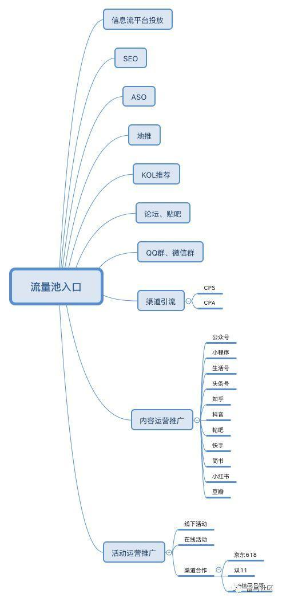

# 流量运营

## 流量池
流量思维
	平台获取用户，用户转化，对用户进行变现后用户就离开了。

流量池思维
	平台获取用户，用户运营转化、留存和裂变以获取更多的用户，保持用户活跃、提高用户复购率，打造自循环体系的自有流量池。
	流量池思维更多不是在于前端获取多少用户，而是强调如何运营用户进行裂变，利用存量用户发展更多新的增量用户。

流量池入口

	
			
## 首页流量模型
流量从哪里来，到哪里去，在首页如何分布。

## 总结

我们必须清楚的认识到——没有什么流量是属于你的，也没有什么用户是忠诚，
	品牌要对用户忠诚，用户却没有任何理由对品牌忠诚。