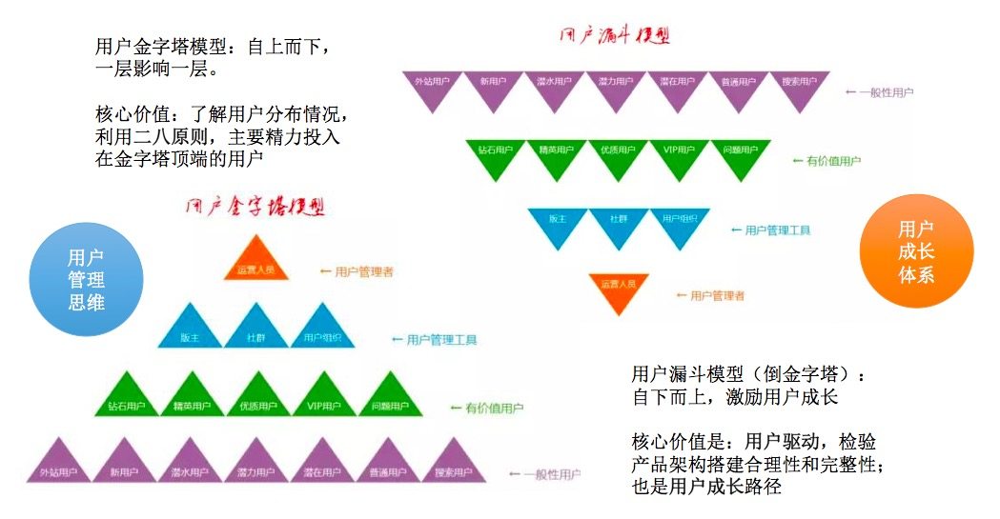
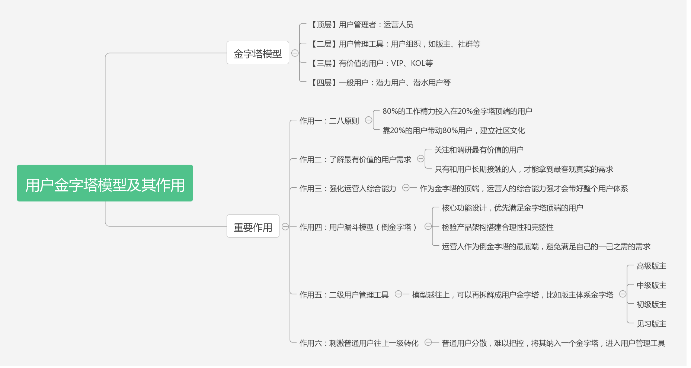
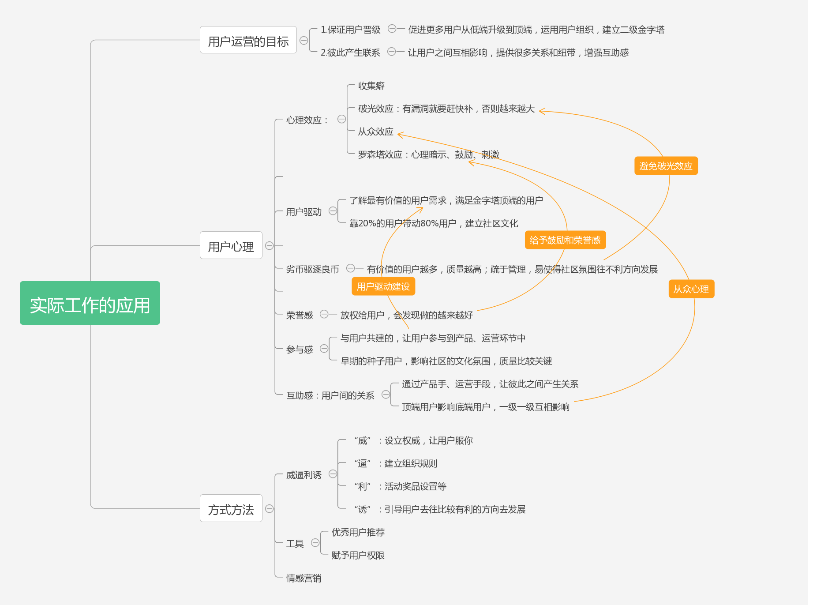
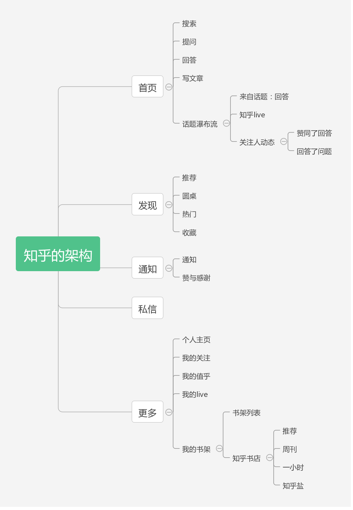
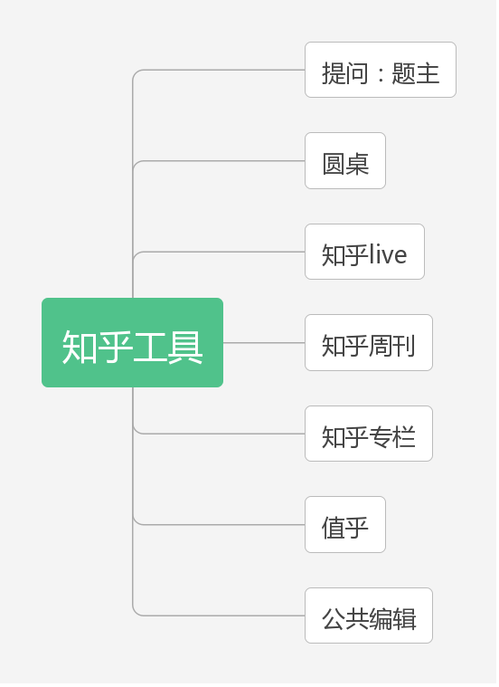
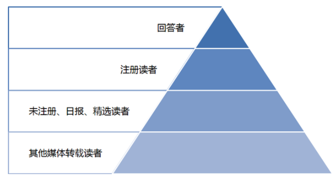

# 用户金字塔模型

用户金字塔模型的建立，自上而下，上层影响下层，主要为了让我们对用户的构成有一个清晰的了解。  
在实际工作中，往往需要抓住的是金字塔顶端20％的用户；  
可以利用用户进行有效地管理用户；  
并且每个模块可以再进行拆解成小金字塔，作为管理工具，增加用户和用户之间的关系。  

倒金字塔模型主要是看作一个用户成长的路径，我们需要对用户的成长进行激励；并且可以检验产品构架搭建的合理性和完整性，实现用户驱动产品。

## 作用

## 实际意义
主要是对用户心理的把握和运用：用户驱动、劣币驱逐良币、荣誉感、参与感以及互助感等。

## 案例-知乎

### 知乎的用户金字塔
知乎是一个问答类社区，定位为“中文互联网上高质量内容社区”。

* 知乎的产品架构

#### 金字塔顶端
这层主要是运营人员、创始人等知乎员工&早期种子用户。

知乎创始人周源，还有黄继新等、李申申等知乎头号员工，回答数和关注度都很高，绝对是知乎金字塔的顶尖人物。

早期种子用户：众所周知知乎在创立初期是采用邀请制。
第一批用户包括李开复、薛蛮子、徐小平、雷军、Keso等业内知名人士，还有很多投资圈、媒体圈人士。  
他们不仅奠定了知乎这个产品基调的基石，也带动了其在短时间内的迅速蹿红。

这批种子用户为知乎的社区氛围和内容提供了非常重要的作用，尽管后期一些种子用户离开知乎或不使用，但无疑他们对知乎的贡献是有极大的帮助和促进作用的。

#### 金字塔第二层
用户的管理工具。知乎的管理工具主要以用户组织偏多。

#### 金字塔的第三层、第四层：

* 知乎的用户构成

围绕知乎用户最紧密的就是点赞数和关注数，也就是内容消费者和内容生产者。
在知乎经常有类似这样的问题“知乎上点赞数最多的答案是什么？”  
因此点赞数较多的用户通常被认为是某个领域有较高造诣的人，因此特别受到关注，而拥有较高的点赞数的用户，其成就感和荣誉感也得到极大的满足。  

### 知乎的用户运营

1.用户驱动&参与感
2.劣币驱逐良币&组织规则
3.荣誉感，帮助建立用户的个人品牌，帮助用户成长
4.互助感和用户间的互动
5.对用户的好处“利”
6.情感营销

## 参考
[用户金字塔模型的应用：知乎案例分析](http://www.woshipm.com/operate/428645.html)
