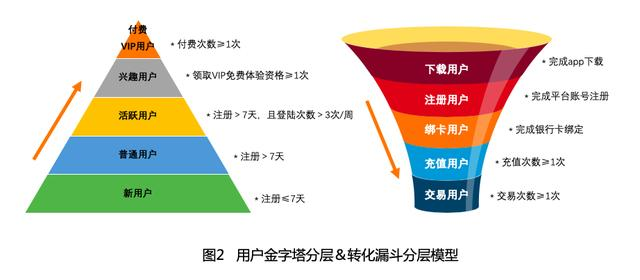
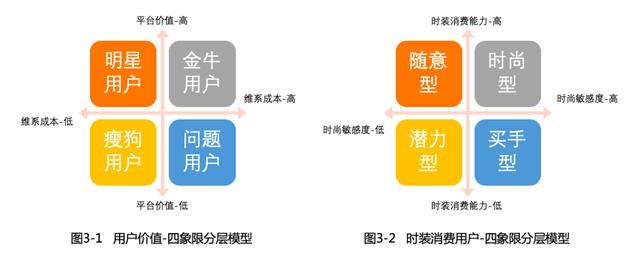

# 用户分层

# [什么是用户分层](WhatIs.md)

* 用户分层在不同的行业中是不一样的，而且可能是多样化的。
比如滴滴打车，用软件打车的人是一种用户；司机也是一种用户；广告商也是一种用户。 
如果要做用户分层的话，就需要对这三种类型的用户分别做一套不同的用户分层体系。

* 用户分层在产品发展的不同阶段会有不同的变化。
比如我们区分价值用户和一般用户，
初期我们产品少，一个月买2次化200元钱可能就是我们的价值用户了。
随着公司的发展我们产品的不断增多，需要一个月买10次化5000元才有能算是我们的价值用户了。

* 用户分层需要定性和定量
如上面的例子一样，我们需要对用户有一个定性的过程，如价值用户、一般用户，或者VIP，超级VIP等等；  
然后必须要对此进行定量，比如消费多少金额才能算价值用户。

# 分层维度

```text
用户访问行为：近X天访问次数、最近1次访问距今X天、访问间隔、访问深度等；
浏览页面：浏览市场、浏览品类、浏览某一特定模块（内容、工具、品类、商详、团详、免费、款式等）；
购买行为：购买次数、购买频次、购买品类；
互动行为：签到、评价/留言、预约、收藏、分享、点赞；
……
```

用户分层要看用户结构化信息，结构化信息指底层用户数据及供给路径，用户分层包含底层、应用、分发三大方面：
```text
底层：搭建运营场景及用户数据分析的基础，由TAG、供给、数据组成；
应用层：核心是场景应用，精细化运营在将用户分级后，需通过场景挖掘、用户测试，将用户匹配最佳场景，从而推荐不同的服务；
分发层：分发的目的是拓量与转化，在我们搭建好这些用户场景之后，如何给场景赋能，带来最大DAU与CTR。
```
由底层到场景应用再到分发，这是一个完整的用户路径，高阶运营应该从用户的完整路径去完搭一套配适的用户模型，从而减少企业的运营成本。

用户路径设计示例（DAU达成为例）：


# 建构分层模型
明确业务需求——所有用户分层都是在特定业务场景下所做的用户细分，明确业务需求才能明确对应视角下的目标用户和业务目标，从而做到有的放矢。
用户聚类分析——用户聚类分析，帮助我们勾勒各个分层的用户画像，也帮助我们提炼用户分层所要选取的核心维度。
分层维度拆解——分层维度即业务所依赖的核心指标或链路，是支撑起用户分层模型的核心“骨架”。
分层模型构建——基于选定的业务维度，并结合用户聚类分析及测试验证的数据，最终找到关键性的数值和节点，从而构建起用户分层模型。

# 常见分层模型
## 一维分层模型
仅基于一个最核心的维度对用户进行划分。



左图是基于用户平台价值维度，构建起的一个用户金字塔模型分层，从下到上用户价值依次递增；  
右图是基于用户交易链路，所构建的一个漏斗转化分层模型，从上到下用户一步步被转化为交易用户。

### [用户金字塔分层模型](Model-UserPyramid/README.md)
### [转化漏斗分层模型]()

一维分层模型中的用户，一般都会沿着核心业务维度的链路方向呈线性迁移状态，即用户的平台价值一般是逐步提升的。  
但部分模型下的用户，也会出现层级跨越的情况，  
比如上图金字塔模型中，通常存在一些注册7天内的用户直接完成付费而跃迁到最高一级付费用户层的情况。

另外，重点运营维护的用户层还可进一步分层运营，  
比如“付费VIP用户”还可根据付费次数、付费金额数值大小，再切分出多个VIP等级进行差异化运营。

## 二维分层模型
顾名思义即选取两个核心业务维度进行二维建模，最经典的就是波士顿矩阵分析法。

### 波士顿矩阵分析法
又称四象限分析法、产品系列结构管理法，最早应用于企业咨询领域，  
用于帮助企业评估和筛选渠道或分析现有的产品结构问题，而其同样也可应用于互联网产品的用户分层模型。



根据用户的平台价值、维系成本高低2个指标维度，构建一个二维的用户模型，从而将平台用户划分为明星、金牛、问题、瘦狗4个象限的用户分层。  
在所有分层中，明星用户是需要重点去培育和做大的人群，问题用户是需要控制和优化的“羊毛”人群，  
金牛用户是需要在可控范围内控制好ROI的人群，瘦狗用户则需要不断尝试提升其平台价值。  

另外，如果是针对电商平台上的时装消费用户进行分层，可以根据此类用户时尚敏感度、时装消费能力2个核心指标进行交叉建模，  
得到类似于图3-2所示的分层模型，从而分人群进行精细化运营。

在二维及以上用户分层模型中，都涉及到一个维度高低分界值的选取问题，这时我们可以与BI、算法团队合作，  
通过二八原理、正态分布分析等方法挖掘关键节点的数据，再结合业务经验和数据来确定、验证和调优。

## 三维分层模型
顾名思义是用三个维度来构建用户分层的模型，比如为人所熟知的RFM模型分层法，这也是用户分层中较为复杂的一类。

### [RFM模型](Model-RFM/README.md)

## [基于生命周期阶段的用户分层](UL-BasedOnUserLifecycle/README.md)

# [用户分层分析](UL-Analysis/README.md)

