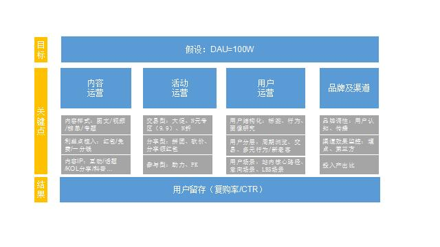

# 用户分层

## [什么是用户分层](WhatIs.md)

## 分层维度

```text
用户访问行为：近X天访问次数、最近1次访问距今X天、访问间隔、访问深度等；
浏览页面：浏览市场、浏览品类、浏览某一特定模块（内容、工具、品类、商详、团详、免费、款式等）；
购买行为：购买次数、购买频次、购买品类；
互动行为：签到、评价/留言、预约、收藏、分享、点赞；
……
```

用户分层要看用户结构化信息，结构化信息指底层用户数据及供给路径，用户分层包含底层、应用、分发三大方面：
```text
底层：搭建运营场景及用户数据分析的基础，由TAG、供给、数据组成；
应用层：核心是场景应用，精细化运营在将用户分级后，需通过场景挖掘、用户测试，将用户匹配最佳场景，从而推荐不同的服务；
分发层：分发的目的是拓量与转化，在我们搭建好这些用户场景之后，如何给场景赋能，带来最大DAU与CTR。
```
由底层到场景应用再到分发，这是一个完整的用户路径，高阶运营应该从用户的完整路径去完搭一套配适的用户模型，从而减少企业的运营成本。

用户路径设计示例（DAU达成为例）：


## [基于生命周期阶段的用户分层](UL-BasedOnUserLifecycle/README.md)

## [用户金字塔模型]()

## [用户分层分析](UL-Analysis/README.md)


