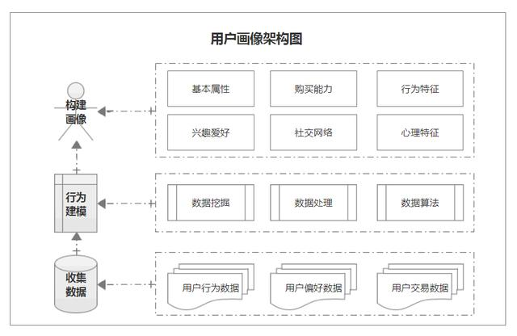
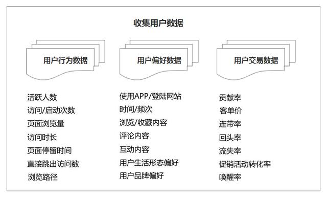
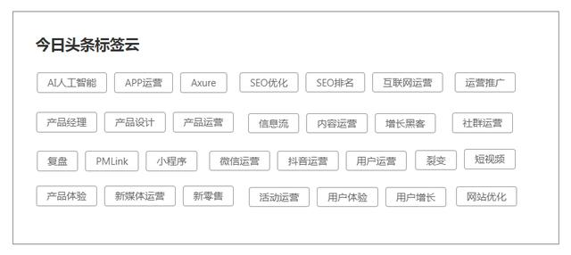
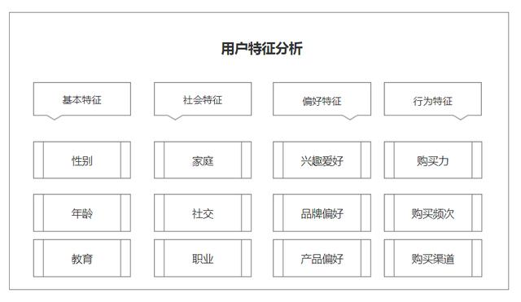

# 用户画像系统

用户画像的核心是为用户打标签。  
即将用户的每个具体信息抽象成标签，利用这些标签将用户形象具体化，从而为用户提供有针对性的服务。

## 收集数据

数据收集主要包括用户行为数据、用户偏好数据、用户交易数据。

## 行为建模

行为建模就是根据用户行为数据进行建模。  
通过对用户行为数据进行分析和计算，为用户打上标签，可得到用户画像的标签建模，即搭建用户画像标签体系。

标签建模主要是基于原始数据进行统计、分析和预测，从而得到事实标签、模型标签与预测标签。

标签建模的方法来源于阿里巴巴用户画像体系，广泛应用于搜索引擎、推荐引擎、广告投放和智能营销等各种应用领域。

* 以今日头条的文章推荐机制为例  

通过机器分析提取你的关键词，按关键词贴标签，给文章打上标签，给受众打标签。  
接着内容投递冷启动，通过智能算法推荐，将内容标签跟观众标签相匹配，把文章推送给对应的人，实现内容的精准分发。  

## 构建画像

用户画像包含的内容并不完全固定，不同企业对于用户画像有着不同对理解和需求。  
根据行业和产品的不同，所关注的特征也有不同，但主要还是体现在基本特征、社会特征、偏好特征、行为特征等。

