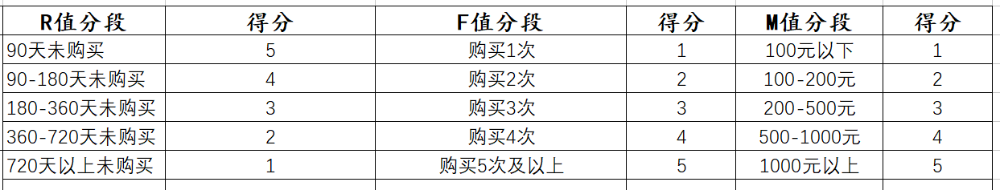

# RFM

RFM 模型 是衡量客户价值和客户创利能力的重要工具和手段。
根据客户活跃程度和交易金额的贡献，进行客户价值细分的一种方法。

## R（Recency）最近一次交易时间间隔
```text
消费指的是客户在店铺消费最近一次和上一次的时间间隔，理论上R值越小的客户是价值越高的客户，即对店铺的回购几次最有可能产生回应。
反映客户交易活跃度。

想要提高回购率和留存率，需要时刻警惕R值。
```

## F（Frequency） 客户在最近一段时间内交易次数
```text
消费频率是客户在固定时间内的购买次数。
反映客户交易活跃度。

一些情况下，会把F值的时间范围去掉，替换成累计购买次数。
```
```text
数据分析：
影响复购的核心因素是商品，因此复购不适合做跨类目比较。
比如食品类目和美妆类目：食品是属于“半标品”，产品的标品化程度越高，客户背叛的难度就越小，越难形成忠实用户；
但是相对美妆，食品又属于易耗品，消耗周期短，购买频率高，相对容易产生重复购买，因此跨类目复购并不具有可比性。
```

## M（Monetray）客户最近一段时间内交易金额
```text
M值是RFM模型中相对于R值和F值最难使用，但最具有价值的指标。“二八定律”：公司80%的收入来自于20%的用户。
反映客户价值。
```

<table>
    <tr>
        <th></th>
        <th>R</th>
        <th>F</th>
        <th>M</th>
    </tr>
    <tr>
        <th>影响因素</th>
        <td>1. 店铺记忆强度</br>2. 接触机会多少</br>3. 回购周期</td>
        <td>1. 品牌忠诚度</br>2. 店铺熟悉度</br>3. 客户会员等级</br>4. 购买习惯养成</td>
        <td>1. 消费能力</br>2. 产品认可度</td>
    </tr>
    <tr>
        <th>应用场景</t>
        <td>决定接触策略</br>决定接触频次</br>决定刺激粒度</td>
        <td>决定资源投入</br>决定营销优先级</br>决定活动方案</td>
        <td>决定推荐商品</br>决定折扣门槛</br>决定活动方案</td>
    </tr>
</table>

## RFM分析的主要作用

* ***识别优质客户***
* 可以制定个性化的沟通和营销服务，为更多的营销决策提供有力支持。
* 能够衡量客户价值和客户利润创收能力。

## 基于RFM模型进行客户细分

实操时可以选择RFM模型中的1-3个指标进行客户细分。

* 细分指标

切记细分指标需要在自己可操控的合理范围内，并非越多越好，
一旦用户细分群组过多，一来会给自己的营销方案执行带来较大的难度，而来可能会遗漏用户群或者对同个用户造成多次打扰。


> 最终选择多少个指标有两个参考标准：店铺的客户基数，店铺的商品和客户结构。

* * 店铺的客户基数
```text
在店铺客户一定的情况下选择的维度越多，细分出来每一组的用户越少。
对于店铺基数不大（5万以下客户数）的店铺而言，选择1-2个维度进行细分即可。
对于客户超过50万的大卖家而言可以选择2-3个指标。
```

* * 店铺的商品和客户结构
```text
如果在店铺的商品层次比较单一，客单价差异幅度不大的情况下，
购买频次（F值）和消费金额（M值）高度相关的情况下，可以只选择比较容易操作的购买频次（F值）代替消费金额（M值）。

对于刚刚开店还没形成客户粘性的店铺，则可以放弃购买频次（F值），直接用最后一次消费（R值）或者消费金额（M值）。
```

### 基于RFM模型中的RF模型进行用户细分


```text
频次划分标准:
	购买1~2次的用户为初级用户，购买3~7次为成长用户，购买7次以上为成熟用户
未购划分标准:
	80%的用户会在哪周购买，90%会在哪周购买
```

* 怎么确定各个参数？

1. 初级、成长、成熟用户实际操作步骤：
取某一时间段用户1转2，2转3，3转4 ... 的转化率。


此处使用的周留存率，可以自行改为月或年，这需要再探讨。
另取拐点时通过的是人眼认为该线是否平缓，也可以采用效率（增长率）定量分析拐点。

2. 活跃、预警、流失、死亡用户定义操作步骤：
取“每个阶段”用户最后2次购买的时间间隔，80%的点为预警，90%点为流失，>180为死亡。


个人认为每个阶段（初级，成长，成熟）都会有不同的点进行预警，所以可能更为复杂一点：
也就是将3个状态的用户分别画出以上3条线，即可划分。

* 有了以上12类用户的划分后，有什么作用？
```text
1. 了解某个时间点，公司发展用户的质量情况。
    可以与历史对比，了解我们的用户质量是否提升还是下降。
2. 针对不同类型的用户可以进一步分析，比如进行M分析得到每类用户的贡献值。
3. 针对不同用户进行不同的策略。
    比如预警用户可以进行一些推送确保个人习惯养成。
```

## 基于RFM模型的客户评分进行用户细分

利用RFM模型的三个属性对客户进行打分，通过打分确定每个用户的质量，最终筛选出自己的目标用户。

* 三个步骤
```text
1. 确定RFM三个指标的分段和每个分段的分值；
2. 计算每个客户RFM三个指标的得分；
3. 计算每个客户的总得分，并且根据总得分筛选出优质的客户。
```

比如，实操的过程中一般每个指标分为3-5段：
其中R值可以根据开店以来的时间和产品的回购周期来判定，F值根据现有店铺的平均购买频次，M值可参考客单价的分段指标。



确认RFM的分段和对应分段的分值之后，就可以按照用户情况对应进行打分。

* 如何验证这个给予的分值就是合理的呢？

需要验证的话，每次对用户数据进行导入之后，需要用算法模型进行回归验证。

