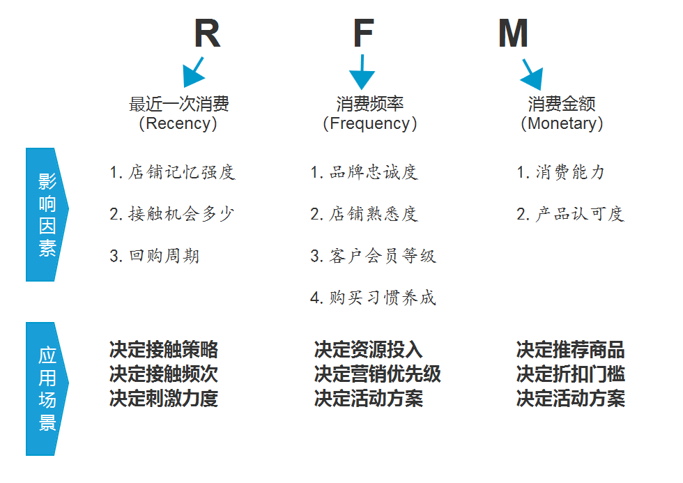

# RFM

RFM 模型 是衡量客户价值和客户创利能力的重要工具和手段。
根据客户活跃程度和交易金额的贡献，进行客户价值细分的一种方法。

## R（Recency）最近一次交易时间间隔
```text
基于最近一次交易日期计算的得分，距离当前日期越近，得分越高。
反映客户交易活跃度。
```

## F（Frequency） 客户在最近一段时间内交易次数
```text
基于交易频率计算的得分，交易频率越高，得分越高。
反映客户交易活跃度。
```

## M（Monetray）客户最近一段时间内交易金额
```text
基于交易金额计算的得分，交易金额越高，得分越高。
反映客户价值。
```



<table>
    <tr>
        <th></th>
        <th>R</th>
        <th>F</th>
        <th>M</th>
    </tr>
    <tr>
        <th>影响因素</th>
        <td>1. 店铺记忆强度</br>2. 接触机会多少</br>3. 回购周期</td>
        <td>1. 品牌忠诚度</br>2. 店铺熟悉度</br>3. 客户会员等级</br>4. 购买习惯养成</td>
        <td>1. 消费能力</br>产品认可度</td>
    </tr>
    <tr>
        <td>应用场景</td>
        <td>决定接触策略</br>决定接触频次</br>决定刺激粒度</td>
        <td>决定资源投入</br>决定营销优先级</br>决定活动方案</td>
        <td>决定推荐商品</br>决定折扣门槛</br>决定活动方案</td>
    </tr>
</table>

## RFM分析的主要作用

* ***识别优质客户***
* 可以制定个性化的沟通和营销服务，为更多的营销决策提供有力支持。
* 能够衡量客户价值和客户利润创收能力。

## RFM的假设前提

假设交易的可能性：
```text
最近交易过的客户 > 最近没有交易过的
交易频率高的客户 > 交易频率低的
交易金额大的客户 > 交易金额小的
```

## 


```text
频次划分标准:
	购买1~2次的用户为初级用户，购买3~7次为成长用户，购买7次以上为成熟用户
未购划分标准:
	80%的用户会在哪周购买，90%会在哪周购买
```

* 怎么确定各个参数？