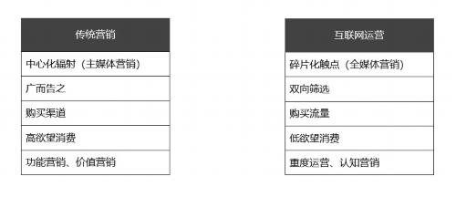
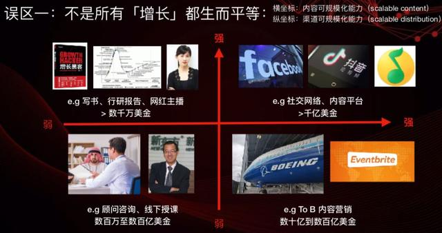

  * [什么是增长？](#什么是增长)
   * [什么是用户增长？](#什么是用户增长)
      * [乔布斯](#乔布斯)
      * [增长是一门科学](#增长是一门科学)
      * [背景](#背景)
      * [趋势](#趋势)
   * [什么是增长黑客？](#什么是增长黑客)
      * [Sean Ellis](#sean-ellis)
      * [使命](#使命)
      * [核心](#核心)
      * [与传统商业产品增长周期区别](#与传统商业产品增长周期区别)
      * [为什么增长黑客会崛起？](#为什么增长黑客会崛起)
      * [特点](#特点)
      * [发展](#发展)
   * [增长黑客与传统营销有哪些本质区别？](#增长黑客与传统营销有哪些本质区别)
   * [对增长以及增长黑客的误解](#对增长以及增长黑客的误解)
      * [误区一：不是所有「增长」都生而平等](#误区一不是所有增长都生而平等)
      * [误区二：滥用「增长黑客」](#误区二滥用增长黑客)
      * [误区三：战术上用力过猛，战略上未尝先行](#误区三战术上用力过猛战略上未尝先行)
   * [影响增长黑客在国内发展的原因](#影响增长黑客在国内发展的原因)
   * [增长黑客是互联网行业创造出来的？](#增长黑客是互联网行业创造出来的)


# 什么是增长？
增长是企业通过自身的长期经营，不断扩大积累而形成的持续性发展。
互联网的世界里一切都是为了增长，灵光一现的创新可能会让一个产品成功，但绝不可能长久。

增长是以增长为目标，以结果为导向，让策略能落地。

# 什么是用户增长？
简单来说，用户增长的根本目的是为了提升产品在一段时间内的有效用户数，进而提升当下和未来的GMV和利润，实现商业成功。

##  乔布斯
“Growth is connecting more people to the existing value of a product。”
```text
产品的 existing value : 必须要有一个核心的产品价值能够传递给我们的用户。
connecting : 把更多的用户和我们既有的产品的价值相连接，这才是真正的 Growth。
```

要使用户能够形成自然增长的势能最后指数级增长，都是依托产品的核心价值。
同时除了让用户了解到产品价值，还需要通过一些传播的方法，让更多的用户能够了解。

## 是一门科学
以用户导向扩展至MVP，AB测试和留存分析，乘胜追击，用户体验地图，注重用户思维，讲究敏捷开发，快速迭代。
数据的价值，用户的反馈，也提到了一个新的高度。

## 背景
市场已经由原来的卖方市场，彻底过渡到现在的买方市场，市场运营理念也从“ 以产品为中心”变成“以用户为中心”。
用户运营思维也由过去的从“吸引认知——引起兴趣——产生渴望-试用评估—购买”的漏斗思维，转化为倒三角的增长思维。

## 趋势
用最小成本购买优质用户
留存一定要做高
同时通过一定的用户运营实现活跃用户的价值输出，即超级用户思维

## 用户增长是围绕供给、需求、平台三方展开的
```text
以用户生命周期为线索，建立一条用户漏斗模型，以用户生命周期价值为主线去建立运营模型
以供给端为线索，建立一条高效率的上单模型，以品类和利润率为主线去建立运营模型
以平台转化率为线索，建立一条高效率的流量分发和交易转化模型，以产品转化率为主线去建立运营模型。
```

# 什么是增长黑客？


## Sean Ellis
2010年的时候，由Sean Ellis首次提出
	增长黑客是三个角色的聚合，既是一个市场营销师，又是产品开发师，又是一个数据分析师。
建立一个强调实验和追求结果的文化，是组建一个增长导向的公司最重要的元素。

## 使命
***“A Growth Hacker is a person whose true north is growth.”***
黑客增长的唯一使命的就是Growth，因为公司的估值是与增长息息相关的，增长是所有公司核心指针。

## 核心
***是以最快的方法、最低的成本、最高效的手段获取大量的增长。***

## 与传统商业产品增长周期区别
传统商业产品增长周期包括口碑、获取、体验、转化、留存，从市场部门、到产品部门、到销售部门、到客服部门。
增长黑客提出了一个新的AARRR的增长模式，Aquisition、Activation、Retention、Revenue、Referral，即获取、激活、留存、变现、推荐。

## 为什么增长黑客会崛起？
Web1.0时代是一个流量为王的时代，Web2.0时代的竞争更加激烈，所以获取好的增长必须有好的产品设计和用户体验。
用户体验与数据的关系“如果一件事物不能衡量它，你就不能增长它或促进它。”一个好的CEO不仅是一个好的营销人员，还是一个创新驱动者。
《精益创业》这本书提出，概念、产品、数据需要实现一个循环。
我们做一个产品，需要先小范围的通过数据驱动快速迭代，快速的验证，再大规模地运用。

## 特点
```text
增长黑客关注整个用户生命周期
增长黑客是由实验和数据驱动的
增长黑客是由跨功能的团队来实现的，跨功能的团队形式
增长黑客是一个体系、方法，并非单个技巧
```

## 发展

2017年3月，全球最大的非酒精饮料公司——可口可乐，宣布取消首席营销官CMO，取而代之的是设立了首席增长官CGO。
为什么传统营销被可口可乐无情地抛弃了？
因为传统营销：生于拉新，死于留存。

CGO的目标：帮助可口可乐转型为一家“以用户为中心，以增长为目标，以数据为驱动”的新零售公司。

# 增长黑客与传统营销有哪些本质区别？

```text
1. 传统营销是以信息为中心的广告轰炸，事后复盘；
   增长黑客是以用户为中心的双向筛选，全程量化。
2. 统营销中的好产品是商家宣传出来的，强调“简单重复，直到你吐”；
   增长黑客中的好产品是用户体验出来的，强调“步步Aha，诱你深入”。
3. 在流量导入上，传统营销重拉新，重销售毛利率，重投入产出比；
   增长黑客重留存，重客户复购率，重低成本获客。
4. 在用户触点上，传统营销是中心化辐射；增长黑客是碎片化触点。
5. 在认知体系上，传统营销侧重抓住用户注意力，形成爆点爆款爆眼球；
   增长黑客侧重开发有用的产品功能，形成Aha moment自我奖励式的用户体验。
6. 在需求管理上，传统营销以“注意力-记忆-欲望”为主线，最终是激发用户产生高欲望，实现“欲望变现”；
   增长黑客以“行为-体验-Aha”为主线，可以在用户低欲望状态下，实现“时间变现”。
7. 传统营销，对营销与销售、运营等概念分得还是比较清晰的；  
   增长黑客，把战略、运营、营销、销售、产品、数据等已经融为一体。
```



# 对增长以及增长黑客的误解

```text
1. 增长黑客的工作就是烧钱买用户，就是拉新
   很多人对增长黑客的认知为，烧钱买用户，做大用户量之后，帮助企业走上“快速增长-融资-上市-圈钱”的道路。
   增长黑客的定义为：依靠技术和数据的力量来达成营销目标，而非传统意义上靠砸钱来获取用户。
   营销目标有很多：拉新、活跃、留存、转化、自转播、复购、首充，这些都是营销目标。
      把增长单单的定义为拉新，而且还是烧钱拉新，这种理解太片面了。

2. 增长黑客的工作就是通过ABTest来测试按钮颜色
   增长黑客需要ABTest，但这不是增长黑客工作的全部。增长黑客有着一套严格的工作流程。
```

* 范冰
## 误区一：不是所有「增长」都生而平等

横坐标：内容可规模话能力；纵坐标：渠道可规模化能力
```text
第一象限 很舒服，内容和渠道都可以规模化，这种就以社交网络平台为核心，这类项目能够成长到千亿美金以上；
第二象限 是内容很难规模化，渠道可以规模化，就像我写书，花了一年多的时间，内容很难规模化，
   但很多人和渠道帮忙分发，渠道就规模化了，同理还有咨询公司的报告、网红直播，这都是因为传播方式便捷可以触达很多人；
第三象限 就是大家都不喜欢的生意，就像咨询顾问、线下授课，你只能把单份时间卖的更贵，才能维持营收；
第四象限 拿内容创业举例，想要 To B 是很难的，内容可以源源不断的输出，但是实际谈判成单流程很麻烦冗长，  
   你依然需要非常强的人因，比如销售、BD、客户成功。
   就算你的内容再多，真正签一个客户通常还是需要经历很久周期，跟很多传统生意没什么区别。
```

所以很多人抱怨为什么我的生意天花板这么低、投资人不给高估值、始终赚不到大钱、  
不能像 XXX 一样百倍千倍地爆发性增长？不妨从上述两个维度寻找原因。

## 误区二：滥用「增长黑客」
业内很多人认为增长黑客就是刷数据的、薅羊毛的，在加上一直以来黑客给人感觉是偷偷摸摸干坏事的人，所以一直以来很多人对「增长黑客」都有误解。  
但其实懂技术的人，多半会将它当成一个褒义词，有点 Geek 的意思。  
比如 Facebook 的总部就在「1 Hacker Way」，扎克伯格当年也在 Facebook 上市招股书上阐述了他们所认同的「黑客之道」。

## 误区三：战术上用力过猛，战略上未尝先行
现在很多人对增长黑客有理解上的偏差，或者只是想单纯效仿而没去深度思考它的实质。  
借用纪德在《人间食粮》末尾的一句话：「丢掉我的书吧，千万不要在这本书中寻找满足感」。  
我希望你能辨证地看待这本书，基于这本书给你的洞察，找到真正适合你的、科学长效的增长方法，而不只是停留在抄袭模仿别人案例的层面。

# 影响增长黑客在国内发展的原因

```text
1. 产品还没有达到PMF就要增长
2. 绝大多数公司没有一个“增长”的架构
   增长黑客这个概念要公司从上到下推进。增长黑客需要调动开发资源，设计资源，产品资源。
   听听身边产品向技术提需求时，双方的口气吧。如果没有由上至下的统一推进，单单依靠某个人或者某个团队的力量，根本无法实现增长。
3. 前几年的互联网红利，让公司有更快速增长的选择
   想想2013~2017年，那时候大家没有精细化运营的概念，有钱就直接买用户。  
   反正移动端的用户还在增长，可以用钱快速解决的事情，要什么增长黑客。
```

可随着流量红利的消失，以及产品同质化越来越严重，相信真正懂得增长的互联网人会变得越来越抢手。

# 增长黑客是互联网行业创造出来的？

增长黑客不是互联网创造出来的。  
“设置目标-分析现状-提出方案-开始小规模测试-收集数据复盘-验证成功大规模推广”的方法论很早之前就存在。

想想我们国家的家庭联产承包责任制，想想我们国家的改革开放的首批试点城市，  
想想我们的房产税，想想我们的二胎计划，是不是和增长黑客有异曲同工之妙？我们的邓公难道是增长黑客第一人？

你把历史再往前推，你会发现增长黑客早就存在了。  

说到底，所谓的增长黑客只是一个已经存在很久的认知方法论。  
很多传统行业的管理方法论跟增长黑客一模一样，比如PDCA循环。

人类没有发现空气之前是怎么呼吸的？
增长黑客同理，聪明的人一直在用这种方法论来理解这个世界。很多人只是没说出来而已。

很多人质疑增长黑客，一个很重要的原因就在于一小部分互联网从业者把“增长黑客”这个概念吹的太狠了。  
而明眼人都知道，这个理念在互联网诞生之前就已经存在了。   

所以不要总是用什么增长黑客标榜自己，你本来就应该采用这种认知方法论来工作。
这世界根本就没有什么增长黑客，或者说人人都可以是增长黑客。

