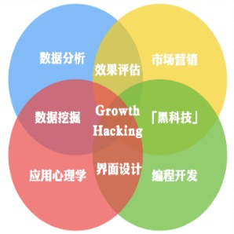

   * [什么是增长？](#什么是增长)
   * [什么是用户增长？](#什么是用户增长)
      * [乔布斯](#乔布斯)
      * [增长是一门科学](#增长是一门科学)
      * [背景](#背景)
      * [趋势](#趋势)
   * [什么是增长黑客？](#什么是增长黑客)
      * [Sean Ellis](#sean-ellis)
      * [使命](#使命)
      * [核心](#核心)
      * [与传统商业产品增长周期区别](#与传统商业产品增长周期区别)
      * [为什么增长黑客会崛起？](#为什么增长黑客会崛起)
      * [特点](#特点)
      * [阶段](#阶段)
      * [具体方法](#具体方法)
         * [第一个例子， 优化获取渠道](#第一个例子-优化获取渠道)
         * [第二个例子，注册流优化](#第二个例子注册流优化)
         * [第三个例子，指标细分](#第三个例子指标细分)
         * [第四个例子，提高用户留存](#第四个例子提高用户留存)

# 什么是增长？
增长是企业通过自身的长期经营，不断扩大积累而形成的持续性发展。

# 什么是用户增长？
用户增长就是不断的提出增长假设，做实验，数据分析验证假设的正确性，以此循环往复，反复迭代。  
用户增长是以增长为目标，以结果为导向，让策略能落地。

互联网的世界里一切都是为了增长，灵光一现的创新可能会让一个产品成功，但绝不可能长久
简单来说，用户增长的根本目的是为了提升产品在一段时间内的有效用户数，进而提升当下和未来的GMV和利润，实现商业成功。



##  乔布斯
“Growth is connecting more people to the existing value of a product。”
```text
产品的 existing value : 必须要有一个核心的产品价值能够传递给我们的用户
connecting : 把更多的用户和我们既有的产品的价值相连接，这才是真正的 Growth。
```

要使用户能够形成自然增长的势能最后指数级增长，都是依托产品的核心价值。
同时除了让用户了解到产品价值，还需要通过一些传播的方法，让更多的用户能够了解。

## 增长是一门科学
以用户导向扩展至MVP，AB测试和留存分析，乘胜追击，用户体验地图，注重用户思维，讲究敏捷开发，快速迭代。
数据的价值，用户的反馈，也提到了一个新的高度。

## 背景
市场已经由原来的卖方市场，彻底过渡到现在的买方市场，市场运营理念也从“ 以产品为中心”变成“以用户为中心”。
用户运营思维也由过去的从“吸引认知——引起兴趣——产生渴望-试用评估—购买”的漏斗思维，转化为倒三角的增长思维。

## 趋势
用最小成本购买优质用户
留存一定要做高
同时通过一定的用户运营实现活跃用户的价值输出，即超级用户思维

# 什么是增长黑客？

## Sean Ellis
2010年的时候，由Sean Ellis首次提出
	增长黑客是三个角色的聚合，既是一个市场营销师，又是产品开发师，又是一个数据分析师。
建立一个强调实验和追求结果的文化，是组建一个增长导向的公司最重要的元素。

## 使命
***“A Growth Hacker is a person whose true north is growth.”***
黑客增长的唯一使命的就是Growth，因为公司的估值是与增长息息相关的，增长是所有公司核心指针。

## 核心
***是以最快的方法、最低的成本、最高效的手段获取大量的增长。***

## 与传统商业产品增长周期区别
传统商业产品增长周期包括口碑、获取、体验、转化、留存，从市场部门、到产品部门、到销售部门、到客服部门。
增长黑客提出了一个新的AARRR的增长模式，Aquisition、Activation、Retention、Revenue、Referral，即获取、激活、留存、变现、推荐。

## 为什么增长黑客会崛起？
Web1.0时代是一个流量为王的时代，Web2.0时代的竞争更加激烈，所以获取好的增长必须有好的产品设计和用户体验。
用户体验与数据的关系“如果一件事物不能衡量它，你就不能增长它或促进它。”一个好的CEO不仅是一个好的营销人员，还是一个创新驱动者。
《精益创业》这本书提出，概念、产品、数据需要实现一个循环。
我们做一个产品，需要先小范围的通过数据驱动快速迭代，快速的验证，再大规模地运用。

## 特点
```text
增长黑客关注整个用户生命周期
增长黑客是由实验和数据驱动的
增长黑客是由跨功能的团队来实现的，跨功能的团队形式
增长黑客是一个体系、方法，并非单个技巧
```

## 阶段
```text
PMF 产品和市场匹配（Product / Market Fit）
优化价值传递
扩大增长规模
```

## 具体方法

### 第一个例子， 优化获取渠道

首先我们要知道用户从哪个渠道来的，其次要了解每一个渠道的转化效率。

### 第二个例子，注册流优化

注册流一个小的改变，从手机+邮箱的注册方式改为邮箱注册方式，使注册人数增加了30%。
接下来就是分解注册率了

### 第三个例子，指标细分
比如周活跃用户

对于创业公司来说，为了增长，需要对这个指标进行分解，并做出增长的预期。

首先用户分为新用户、老用户、访客等，我们可以通过这种方式，将一个简单的指标，分解成一个可执行的指标。
再对新增用户的平台或渠道进行细化，将产品策略通过平台或渠道进行调整。

### 第四个例子，提高用户留存

为什么要关注用户留存？因为用户留存直接代表了用户的活跃度。

Facebook当时有一个法则：4-2-1
	这是针对美国市场定的一个法则，国内产品经理可以借鉴使用
	通过查询分析不同功能的粘度，发现粘度最大的功能后，集中精力推这个功能，实现用户留存率的增长。

